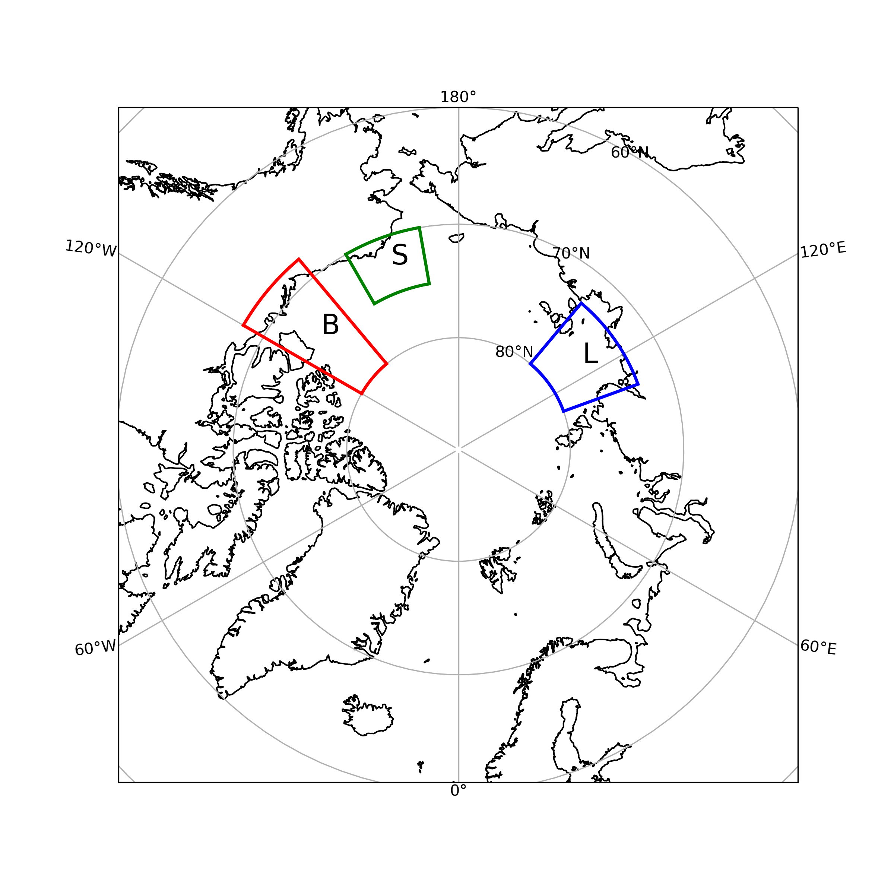

# overcast

## Collaborators
- Kyle Duncan
- Zheng Liu
- Axel Schweiger
- Michel Tsamados
- Dongxiao Zhang
- Molly Wieringa
- Sunny Sun-Mack

### Team Lead 
Zheng Liu

### DataSets
- ICESat-2 [ATL07](https://nsidc.org/data/ATL07)
- ICESat-2 [ATL09](https://nsidc.org/data/atl09) 
- ICESat-2 [ATL10](https://nsidc.org/data/atl10)
- some MISR derived roughness products (optional)
- auxiliary MODIS for cloud mask + for context
- Sentinel1 for SAR
- ICESat-2 [ATL03](https://nsidc.org/data/atl03) 

### Region of Interest
- Eastern Beaufort sea (B; leads)
- Siberian laptev sea (L; polynyas)
- PMEL saildrone region (S; in-situ)

### Science Questions
The huge heat and moisture fluxes from the leads to the atmosphere have been can modify the atmospheric boundary layer and contribute to cloud formation. ICESat-2 was the first to provide instantaneous observations of leads and vertical structure of clouds over Arctic Ocean at such fine scales. The goal of this project is to explore the effects of sea ice leads on clouds in the Arctic. Some questions to consider: Do they result in more/deep clouds? How about open/refrozen leads?

Some Statistics: 
probability of clouds over leads vs clouds over ice.
cloud thickness, etc based on type of lead classification.
cloud optical depth distribution over leads.

    
    
### Technical Goals
Develop a merged-multi-dataset product. 
Trying to build tools for later use with a small use case.
Exploring relationships, regression, etc.
